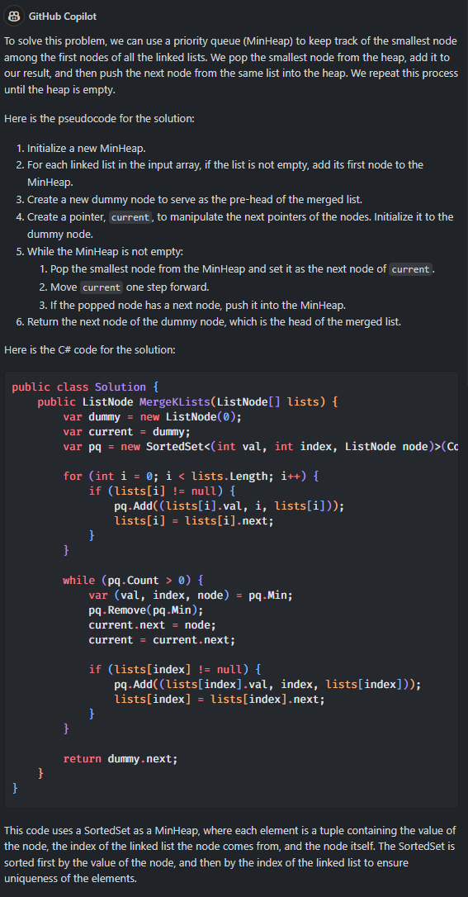
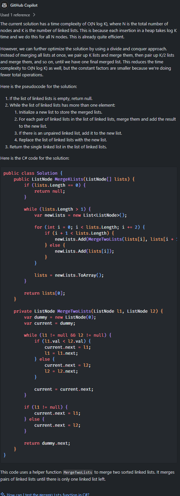

## DEMO 1 - [LeetCode](https://leetcode.com) 
#### 1. Use the following [Demo](https://leetcode.com/problems/merge-k-sorted-lists/) to submit an answer to leet code and evaluate performance. Prompt should look like the text in [01_leetcode.prompt.txt](01_leetcode.prompt.txt). Copy and paste the prompt in Copilot Chat.
Example Response
<p style="margin-left: 30px;"></p>

#### 2. Paste the answer into the web based Leetcode editor and evaluate the results. 

#### 3. Try to get a better result with further prompting:
Paste Copilot's response to the question:
```
Can you improve the performance and reduce the time complexity?
```
Example Response
<p style="margin-left: 30px;"></p>
  
