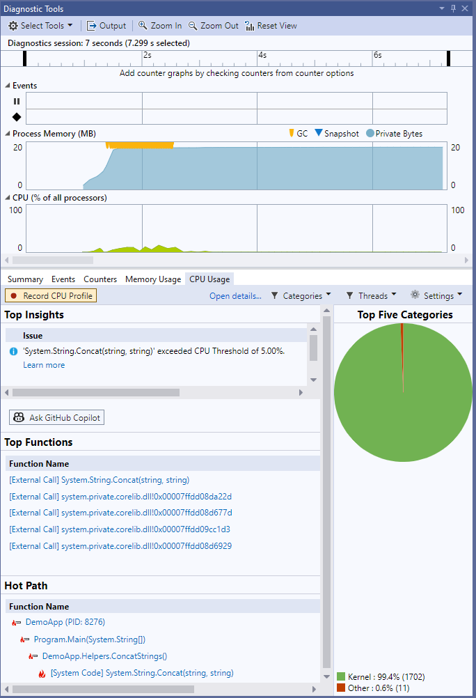
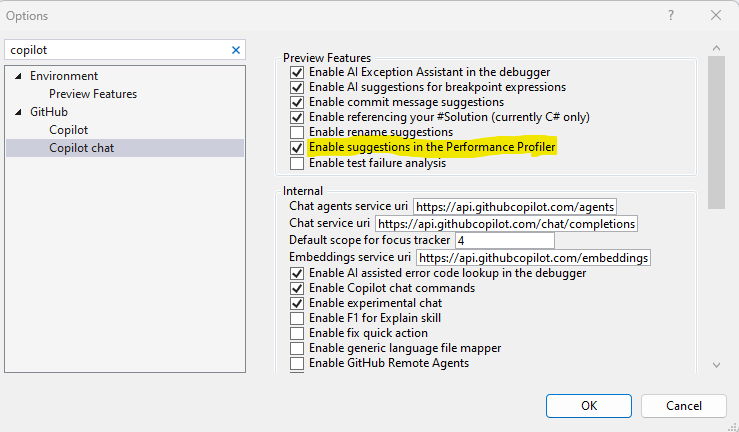

# DEMO 3 - Visual Studio Debugging and CPU Analysis

There are various demos in the sample [project](..//dotnet/).
1. It will help to make sure the Diagnostic tools window is showing: **Debug** > **Windows** > **Show Diagnostic Tools**
2. For the demo showing off the CPU analyzer, make sure CPU Usage is being analyzed by checking (in the Diagnostic Tools pane): **Select Tools** > [✓] **CPU Usage**

## DEMO: CPU Profile Auto Insights
Go to the [Program.cs](..//dotnet/DemoApp/DemoApp/Program.cs) and uncomment the lines under the "String Concatenation Demo".
Your Diagnostics Panel should show something similar to below. 

*NOTE: If you don't see the "Ask GitHub Copilot" button, refer to the options shown below

## DEMO: Beyond intellisense
This can demo an issue where debugging, intellisense, and code analysis may only get you so far. In the following referenced code, there is a bug that doesn't throw any runtime exceptions and would most likely not be discovered through intellisense. It can result from a common misunderstanding of C# code's operands.

Go to `ScopedService.cs` and scroll to the `Incorrect Operator Demo` region
In the `MyType` enum, `MyType.None` is defined as 0. When you perform a bitwise `AND` operation with 0, the result is always 0, regardless of the other operand. No matter the value provided to the method `OperatorEvaluation`, it will always return true. 

To prompt Copilot, reference the file and ask:

  Why does the OperatorEvaluation method always return true even if the value of typeToCheck is not MyType.None?

## DEMO: Discover runtime errors in nested code
This can show that Copilot can follow referenced methods to describe a runtime error that's not throwing an exception. In this demo, the DoSomethingAsync method in the `ScopedService.cs` file is defined as an async void method. This is a special kind of asynchronous method in C# that is primarily intended for event handlers. The problem with async void methods is that exceptions thrown by them cannot be caught outside of the method.
When `DoSomething` throws an exception, it is not caught by the `DoSomethingAsync` method because it's an async void method. The exception is instead thrown directly on the SynchronizationContext that was active when the async void method started, and it's not catchable. This is why you don't see any exceptions while debugging.

Go to `Program.cs` and uncomment the code for the AsyncVoid demo. Running the program shows that no exception is caught, even though it plainly is throwing an exception in the `DoSomething` method.

To let Copilot teach you why this is happening, referencing the file ScopedService, prompt Copilot with:
"Why don't I get any exceptions while debugging the method DoSomethingAsync in #ScopedService.cs?

## DEMO: Explain confusing code
Go to `ScopedService.cs` and scroll to the `InsaneAlgorithm Demo` region
Quickly review the method. Showing that due to cyclomatic complexity, bad comments, bad variable naming, and other reasons, this is hard to understand.
Highlight the method and ask copilot to help you understand it with `/explain`.

What's not covered yet, but could be:
* Refactoring
* Adding comments
* Removing redundant code